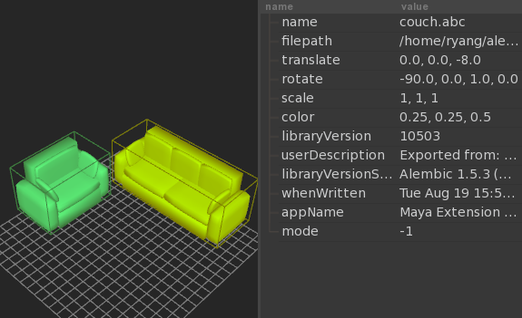
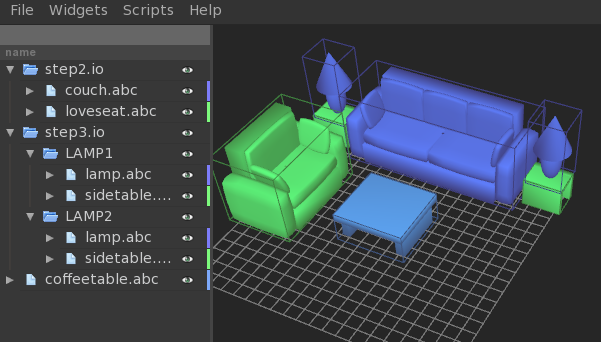

.. _overrides:

Hierarchical Assets Example
---------------------------

This doc attempts to demonstrate how to construct a simple heirarchical asset,
with instances and contextual overrides. We'll create a simple environment
asset composed of smaller subassets. In this case, a living room with a couch,
coffee table, and side tables with lamps.

Step 1
~~~~~~

::

                >>> from abcview.io import Session
                >>> s = Session()
                >>> s.add_file("lamp.abc")
                >>> s.add_file("sidetable.abc")

Note: this is the same as loading both of these abc files into AbcView

::

                $ abcview lamp.abc sidetable.abc

Translate the lamp scene up on the y-axis and save the session

::

                >>> s.items[0].translate = (0, 2, 0)
                >>> s.save("step1.io")

Load the session file into AbcView

::

                $ abcview step1.io

Note: you can also move the lamp on top of the table using the properties widget: 
(ctrl+shift+p or Widgets->Properties), select the lamp, then 
double-click the translate value and enter 0, 2, 0 
and hit enter.

Step 2
~~~~~~

Load an instance of the couch and loveseat assets into a new session, and translate
them

::

                >>> s = Session()
                >>> s.add_file("couch.abc")
                >>> s.add_file("loveseat.abc")
                >>> s.items[0].translate = (0, 0, -8)
                >>> s.items[0].rotate = (-90, 0, 1, 0)
                >>> s.items[1].translate = (-8, 0, 0)
                >>> s.items[1].rotate = (-90, 0, 1, 0)
                >>> s.save("step2.io")

It should look like this

Step 3
~~~~~~

Now let's load two instances of the step1.io compound asset created in Step 1,
and give them new names

::

                >>> s = Session()
                >>> s.add_file("step1.io")
                >>> s.add_file("step1.io")
                >>> s.items[0].name = "LAMP1"
                >>> s.items[1].name = "LAMP2"
                >>> s.save("step3.io")

Loading step3.io into AbcView it should look like this

Step 4
~~~~~~

Instance the step2.io asset, the step3.io asset and the coffee table asset

::

                >>> s = Session()
                >>> s.add_file("step2.io")
                >>> s.add_file("step3.io")
                >>> s.add_file("coffeetable.abc")

Then change the position of the coffee table

::

                >>> s.items[2].rotate = (90, 0, 1, 0)

Now, let's move lamps next to the couch in this scene by settings its translate 
property using contextual overrides, and save the scene

::

                >>> s.items[1].items[0].add_override("translate", (-9.0, 0.0, -8.0))
                >>> s.items[1].items[1].add_override("translate", (9.0, 0.0, -8.0))
                >>> s.save("step4.io")

You should have a scene that looks like this

Step 5
~~~~~~

Now go back to the step1.io asset and change the height of the lamp, and it should
get updated in any compound assets that reference it

::

                >>> s = Session("step1.io")
                >>> s.items[0].scale = (1, 0.7, 1)
                >>> s.save()

Re-open the step4.io asset and you should see both lamps are now shorter

These are just simple examples, but any property, TRS values or arbitrary attributes, can 
have a contextual override in referencing session files.

